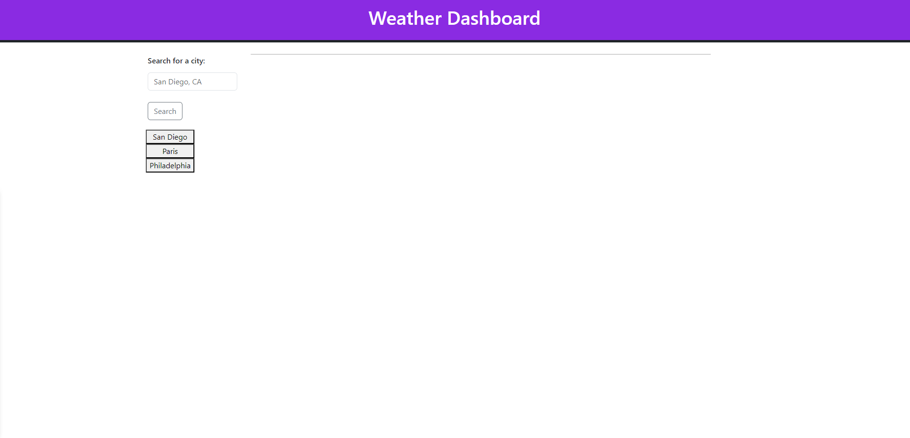
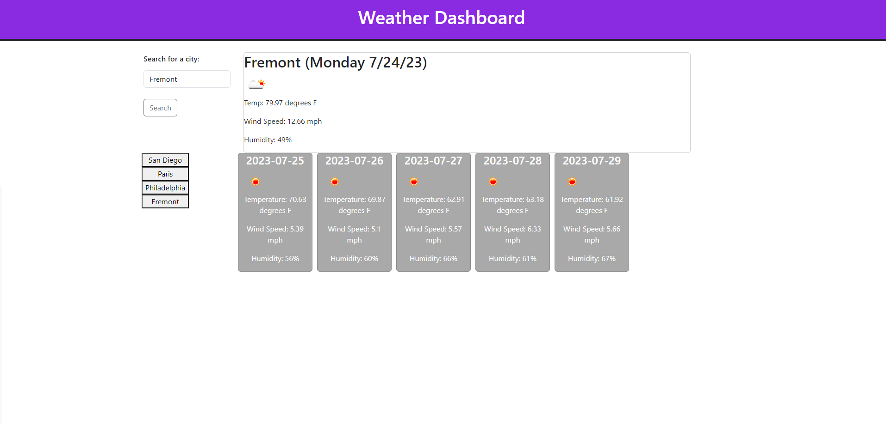

# Weather Website

# Description
    -This project involved creating a weather website.
    -The weather website is responsive to the user choice of city upon clicking the search button or hitting enter after typing.
    -When the user searches for a city the current weather appears to the right and then below that is the 5 day forecast for that city.
    -When the user searches for a city, that city is added to the list of search history cities.
    
    
# Installation

    Follow the following URL to the website: https://caf62219.github.io/weather-website/
    
# Usage

   
    -When you load the page, previously searched cities appear on the left hand side as clickable buttons.

   
    
    - When you click on the buttons on the left the website shows weather data for that city.
    -The current weather appears on the top right and the 5 day forecast appears on the bottom right.

# Credits
    Donnie Rawlings: https://github.com/drawlin22/
    Received assistance from AskBCS John Armstrong.
    Assistance from Jehyun TA and Jamie TA
    Received assistance from AskBCS Joem Casusi
    Received assistance from AskBCS Omar Peart
    Received assistance from AskBCS Max Dunn
   
# License
    MIT